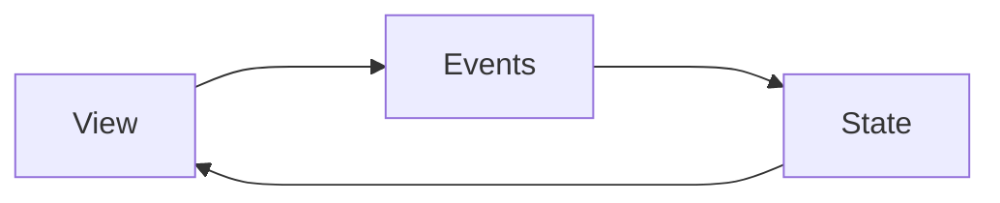

# Blazor

## Notes:

1. Static Server Side Rendering: 
   
   * Static server-side rendering (static SSR)
   * Means normal traditional web request and response.

2. Server Interactivity: 
   
   * Interactive server-side rendering (interactive SSR).
   * Uses SignalR. 
   * No page reload. 
   * Uses blazor server.

3. Interactive WebAssembly
   
   * Client-side rendering (CSR).
   * Uses Blazor WebAssembly

4. Interactive Auto (Server, then client)
   
   * Interactive SSR using Blazor Server initially.
   * Then CSR on subsequent visits after the Blazor bundle is downloaded.

5. When we add interactivity to a component it becomes stateful.

6. 

## Intro

Component based Single Page Application (SPA).
Each component

Blazor provides flexibility in how application components are rendered and executed:

- **Blazor WebAssembly (WASM):** C# code executes directly in the browser using WebAssembly. This allows the app to run entirely client-side, reducing server load.
- **Blazor Server:** UI events are handled on the server and synced back to the browser using a real-time SignalR connection. The UI updates are instantly merged into the DOM.
- **Blazor Hybrid:** Allows developers to embed Blazor components into native mobile (MAUI) and desktop applications.

## Server Management App

**Create Project**
Create Project ➡️ Blazor Web App ➡️Interactive render mode: None

**Routable Component**: It has page. eg. "/servers"
Under pages, create a Blazor Component named `Servers.razor`

**Non-Routable Component**: It is a widget. Can be shared.
Under components ➡️ Widgets, create a Blazor Component named `ServerWidget.razor`
To use it import as `<ServerWidget />`

## Stream Rendering

In Blazor, **Stream Rendering** allows the server to send HTML to the browser progressively instead of waiting for the whole page to finish rendering. It improves perceived performance, especially when data loading takes time.

**Without Stream Rendering**

Normally:

1. User requests page
2. Server waits for DB/API calls
3. Entire page renders
4. Browser receives HTML

The user sees a blank/loading delay.

**With Stream Rendering**

Blazor sends partial HTML immediately:

1. Initial UI renders quickly
2. Loading placeholders appear
3. Remaining content streams later
4. UI updates automatically

Much smoother UX.

## Static Assets Fingerprinting

In Blazor, **Static Assets Fingerprinting** is a cache-busting technique where CSS/JS/image files get a unique hash in their filename or URL. This ensures browsers always load the latest file after deployment.

File name before hashing `main.css` and after hashing `main.232dsde.css`

Usage:

`<link rel="stylesheet" href="@Assets["app.css"]" />`

## Interactive Server Mode

When we declare interactive server model as global, so to make any one of the components non-interactive we can do this by following.

Declaring Global 

`App.razor`

```csharp
<HeadOutlet @rendermode="PageRenderMode" />
<Routes @rendermode="PageRenderMode" />

@code {
    [CascadingParameter]
    private HttpContext HttpContext { get; set; } = default!;

    private IComponentRenderMode? PageRenderMode
        => HttpContext.AcceptsInteractiveRouting() ? InteractiveServer : null;
}
```

Excluding from a Component

`@attribute [ExcludeFromInteractiveRouting]`

## Three Interactive Components

1. View
2. Events: actions
3. States: data


