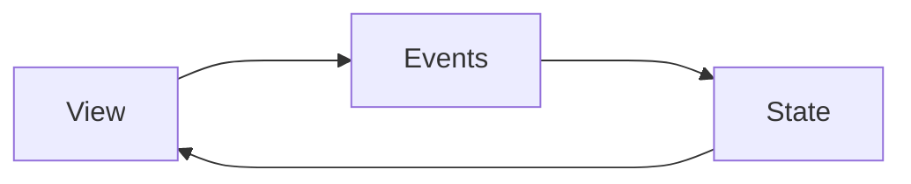
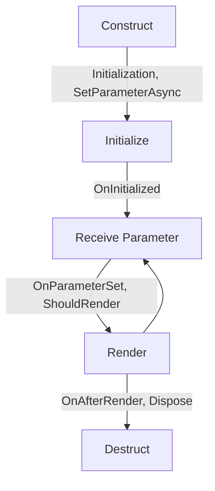
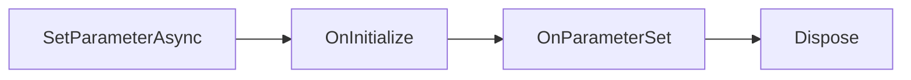

# Blazor

## Notes:

1. Static Server Side Rendering: 
   
   * Static server-side rendering (static SSR)
   * Means normal traditional web request and response.

2. Server Interactivity: 
   
   * Interactive server-side rendering (interactive SSR).
   * Uses SignalR. 
   * No page reload. 
   * Uses blazor server.

3. Interactive WebAssembly
   
   * Client-side rendering (CSR).
   * Uses Blazor WebAssembly

4. Interactive Auto (Server, then client)
   
   * Interactive SSR using Blazor Server initially.
   * Then CSR on subsequent visits after the Blazor bundle is downloaded.

5. When we add interactivity to a component it becomes stateful.

6. 

## Intro

Component based Single Page Application (SPA).
Each component

Blazor provides flexibility in how application components are rendered and executed:

- **Blazor WebAssembly (WASM):** C# code executes directly in the browser using WebAssembly. This allows the app to run entirely client-side, reducing server load.
- **Blazor Server:** UI events are handled on the server and synced back to the browser using a real-time SignalR connection. The UI updates are instantly merged into the DOM.
- **Blazor Hybrid:** Allows developers to embed Blazor components into native mobile (MAUI) and desktop applications.

## Server Management App

**Create Project**
Create Project ➡️ Blazor Web App ➡️Interactive render mode: None

**Routable Component**: It has page. eg. "/servers"
Under pages, create a Blazor Component named `Servers.razor`

**Non-Routable Component**: It is a widget. Can be shared.
Under components ➡️ Widgets, create a Blazor Component named `ServerWidget.razor`
To use it import as `<ServerWidget />`

## Stream Rendering

In Blazor, **Stream Rendering** allows the server to send HTML to the browser progressively instead of waiting for the whole page to finish rendering. It improves perceived performance, especially when data loading takes time.

**Without Stream Rendering**

Normally:

1. User requests page
2. Server waits for DB/API calls
3. Entire page renders
4. Browser receives HTML

The user sees a blank/loading delay.

**With Stream Rendering**

Blazor sends partial HTML immediately:

1. Initial UI renders quickly
2. Loading placeholders appear
3. Remaining content streams later
4. UI updates automatically

Much smoother UX.

## Static Assets Fingerprinting

In Blazor, **Static Assets Fingerprinting** is a cache-busting technique where CSS/JS/image files get a unique hash in their filename or URL. This ensures browsers always load the latest file after deployment.

File name before hashing `main.css` and after hashing `main.232dsde.css`

Usage:

`<link rel="stylesheet" href="@Assets["app.css"]" />`

## Interactive Server Mode

When we declare interactive server model as global, so to make any one of the components non-interactive we can do this by following.

Declaring Global 

`App.razor`

```csharp
<HeadOutlet @rendermode="PageRenderMode" />
<Routes @rendermode="PageRenderMode" />

@code {
    [CascadingParameter]
    private HttpContext HttpContext { get; set; } = default!;

    private IComponentRenderMode? PageRenderMode
        => HttpContext.AcceptsInteractiveRouting() ? InteractiveServer : null;
}
```

Excluding from a Component

`@attribute [ExcludeFromInteractiveRouting]`

## Three Interactive Components

1. View
2. Events: actions
3. States: data




## Quick Grid

QuickGrid is a lightweight, fast data grid component for Blazor provided by Microsoft.

Install: Microsoft.AspNetCore.Components.QuickGrid

Features:

* Sorting
* Pagination
* Virtualization
* Template columns
* Fast rendering
* Works well with EF Core
  
  

## Non-Routable Component  Deep Dive

1. Extracting all the sharable components into the `widgets/mywidget.razor`.

2. Communicate from parent to child components.

3. EventCallback to pass info from child to parent components.

4. Reference a child component.

5. StateHasChanged to Re-render a Component.

6. Reuse routable component as non-routable component.

7. CSS Isolation.

8. Cascading parameter to pass values down the component tree.

9. Cascading Parameter crossing render mode boundary.

10. Use templated components to create generic components.

11. QuickGrid to display our servers in the table with Pagination, Filter and Sort.

12. Arbitrary attributes to provide flexibility.
    
    

## Component Lifecycle

Lifecycle



**Contruct**: During this, the component goes into the memory.

**Static SSR -> Events**



**Interactive Server -> Events**

```
SetParameterAsync --> OnInitialize --> OnParameterSet --> 
Dispose --> *SetParameterAsync --> OnInitialize --> 
OnParameterSet --> ShouldRender (initially not present) 
--> OnAfterRender
```

During the first request to the server, server responses and call first set of Event hooks. The second set is called when SignalR connection is established. On every set, reinitialization is done which is not shown above. If any parameter changed, from OnParameterSet all are called. The two calles bez if pre-rendering in on.

**When there is one parent and one child component**

First set called for both parent and child components and again after establishing SignalR channel second set called for both. Note that parent components all event hooks are called first. 

## Problems with Events

**The problem of component initialization**

`OnInitialize` and Initialization variables calls twice. Due to this our variable initialized twice.
`private List<City> cities = CityRepo.GetAllCities();`
This will be called twice. This is the problem.

**Solution**

Note: To initialize anything which takes a good amount of resource we need to do it like this. 

```csharp
private List<City>? cities;
OnInitialized(){
    // Only true if SignalR connection is established.
    if(RenderInfo.IsInteractive){
        cities = CityRepo.GetAllCities();
    }
}
```

**The problem with OnParameterSet**

OnParameterSet is called whenever there is a change in any one of the parameters.
Ex.

```c#
[Parameter]
CityName
[Parameter]
SearchFilter

OnParameterSet(){
    if(SearchFilter is empty)
        servers = ServerRepo.GetServerData()
    else
        servers = ServerRepo.SearchServer()
}
```

When we change the SearchFilter, the OnParameterSet is called and perform heavy lifting from database.

**Solution**

Use `SetParameterAsync` to check weather the parameter has changed or not.

**When does a component render**

1. When component created.
2. When events are triggered. (Clicking on button, dropdown, input box). --> based on state variable, if changed. That components are changed are re-rendered.
3. When parameter changed.
4. When StateHasChanged called.

**The problem of ShouldRender** 

Complex parameter type and ShouldRender

## Routing

### Static vs Interactive Routing

* Static Routing: Every time user request for a page to the server, server sends a page. Whereas in Interactive Routing, only first time request goes to the server via req protocol, rest page request routed by SignalR channel.
* In WASM, there is no req and res by the server, as the js is already downloaded to the client.

### Navigation Lock

Used to prevent navigation

## State Management

**Use URL to maintain the state**

```csharp
// Page 1
NavigationManager.NavigateTo($"/cityname?servername={servername}")
// Page 2
NavigationManager.NavigateTo($"/cityname?servername={serverName}&cityname={cityName}")
```

**Use browser storage to maintain the state**

| Feature                      | Session Storage              | Local Storage                | Cookies                         |
| ---------------------------- | ---------------------------- | ---------------------------- | ------------------------------- |
| Storage Limit                | ~5 MB                        | ~5–10 MB                     | ~4 KB                           |
| Expiry                       | Ends when tab/browser closes | Stays until manually cleared | Can have expiry date            |
| Shared Across Tabs           | No                           | Yes (same origin)            | Yes                             |
| Sent to Server Automatically | No                           | No                           | Yes                             |
| Accessible via JavaScript    | Yes                          | Yes                          | Yes (unless HttpOnly)           |
| Best Use Case                | Temporary tab data           | Persistent client data       | Authentication/session tracking |

`SessionStorage.cs`

```csharp
public class SessionStorage
{
    private readonly ProtectedSessionStorage protectedSessionStorage;

    public SessionStorage(ProtectedSessionStorage protectedSessionStorage)
    {
        this.protectedSessionStorage = protectedSessionStorage;
    }

    public async Task<Server?> GetServerAsync()
    {
        var res = await this.protectedSessionStorage.GetAsync<Server>("server");
        if (res.Success)

            return res.Value;
        else
            return null;
    }

    public async Task SetServerAsync(Server? server)
    {
        await this.protectedSessionStorage.SetAsync("server", server);
    }
}
```

`Program.cs`

Inject the SessionStorage

```csharp
builder.Services.AddTransient<SessionStorage>();
```

Use in the Components

```csharp
@inject SessionStorage sessionStorage

await sessionStorage.SetServerAsync(server)

if(RendererInfo.IsInteractive){
    this.server = await this.sessionStorage.GetServerAsync();
}
```

**Use DI box to maintain the state**

In Static SSR, DI box reside in Server and in WASM DI box resides in client side.

`ContainerStorage.cs`

```csharp

public class ContainerStorage
{
    private Server _server = new Server();
    public Server GetServer() { return _server; }
    public void SetServer(Server server) { _server = server; }
}
```

Inject the ContainerStorage

```csharp
builder.Services.AddScoped<ContainerStorage>();
```

Use in the Components

```csharp
@inject ContainerStorage containerStorage

await containerStorage.SetServer(server)

if(RendererInfo.IsInteractive){
    this.server = this.containerStorage.GetServer();
}
```

**Transient**: A new instance is created every time the service is requested.

**Scoped**: One instance per user circuit/connection.

**Singleton**: Only one instance for entire application lifetime.

## Observer: To access states across component trees


